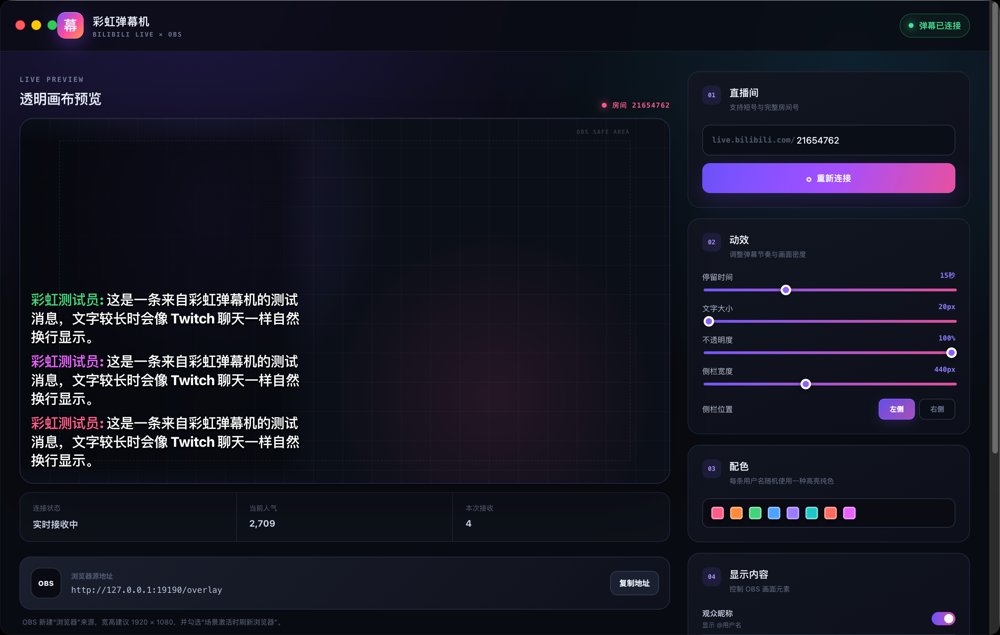
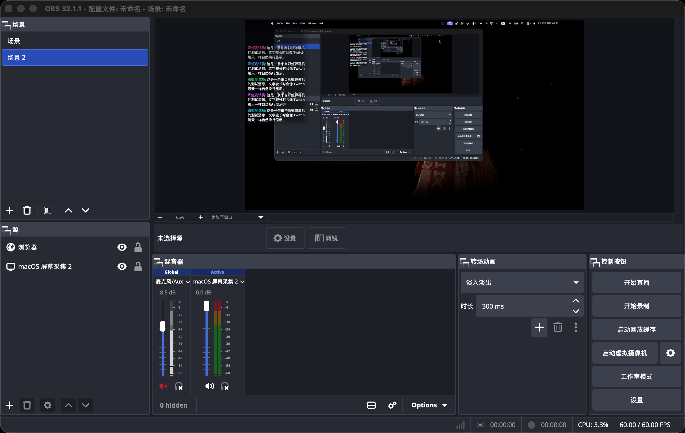

# 彩虹弹幕机

一款面向 macOS 和 OBS 的 B 站直播弹幕叠加工具。输入直播间号后，应用会连接 B 站直播消息流，并在透明浏览器源中显示 Twitch 风格的侧栏弹幕。

## 界面预览

### 控制面板



### OBS 效果



## 使用方法

1. 打开 `彩虹弹幕机.app`。
2. 输入 B 站直播间短号或完整房间号，点击“连接弹幕”。
3. 在 OBS 中新建“浏览器”来源。
4. URL 填写 `http://127.0.0.1:19190/overlay`。
5. 宽度设为 `1920`、高度设为 `1080`，勾选“场景激活时刷新浏览器”。

关闭控制窗口后，应用仍会在 macOS 后台运行，以保证 OBS 弹幕不中断。需要彻底退出时，请按 `⌘Q`，或从菜单选择“退出彩虹弹幕机”。

## 功能

- 支持 B 站直播间短号和完整房间号
- 适配新版 WBI 签名弹幕接口
- 透明 OBS 浏览器源
- 每条消息随机高亮纯色昵称、白色正文、长消息自动换行
- 左右侧栏、宽度、停留时间、字号与不透明度调节
- 昵称、阴影、礼物与醒目留言开关
- 屏蔽词与测试弹幕
- 自动断线重连
- 本地保存设置，不上传配置

## 从源码运行

需要 Node.js 22 或更高版本：

```bash
npm install
npm run dev
```

打包 macOS 应用：

```bash
npm run dist
```

## 说明

本项目使用 B 站公开网页接口和直播 WebSocket 消息流。接口规则可能随平台更新而变化。请遵守 B 站直播服务协议，不要将本工具用于刷屏、骚扰或大规模数据采集。
